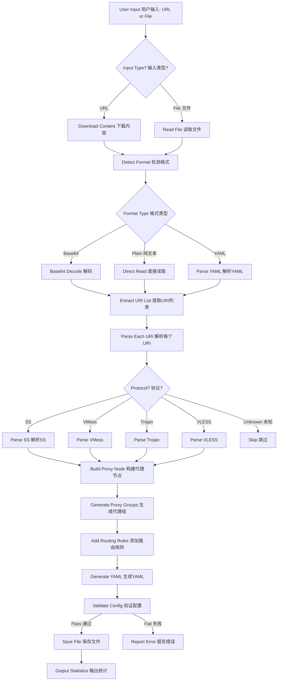

# Development Documentation | 开发文档

> Technical documentation for developers and contributors of the Clash Subscription Converter.
> 
> Clash 订阅转换工具的开发者和贡献者技术文档。

---

## 📋 Table of Contents | 目录

1. [Project Background | 项目背景](#project-background--项目背景)
2. [Architecture Overview | 架构概述](#architecture-overview--架构概述)
3. [Module Design | 模块设计](#module-design--模块设计)
4. [Workflow Details | 工作流程详解](#workflow-details--工作流程详解)
5. [API Reference | API 参考](#api-reference--api-参考)
6. [Testing Strategy | 测试策略](#testing-strategy--测试策略)
7. [Configuration Templates | 配置模板](#configuration-templates--配置模板)
8. [Troubleshooting Guide | 故障排除指南](#troubleshooting-guide--故障排除指南)
9. [Contributing Guidelines | 贡献指南](#contributing-guidelines--贡献指南)
10. [Roadmap | 路线图](#roadmap--路线图)

---

## 📖 Project Background | 项目背景

### Problem Statement | 问题陈述

The traditional workflow for converting Clash proxy subscriptions requires 20+ manual steps:

传统的 Clash 代理订阅转换工作流程需要 20+ 个手动步骤：

1. **Tedious process | 繁琐过程**: Multiple tools needed (curl, base64, text editor) | 需要多个工具
2. **Repetitive work | 重复工作**: Same steps required every time subscription updates | 每次更新订阅都需要重复相同步骤
3. **Format conversion | 格式转换**: Base64 decoding, URI parsing, YAML generation need different tools | 需要不同工具
4. **No validation | 无验证**: Manual operations make it difficult to verify intermediate results | 手动操作难以验证中间结果
5. **Maintenance burden | 维护负担**: Changing airports/subscriptions requires relearning the process | 更换机场需要重新学习流程

### Solution Design | 解决方案设计

This tool provides | 本工具提供：

- **One-click conversion | 一键转换**: Input subscription link → Output complete configuration | 输入订阅链接 → 输出完整配置
- **Automatic format detection | 自动格式检测**: Recognizes base64/plain text/YAML formats | 识别 base64/纯文本/YAML 格式
- **Multi-protocol support | 多协议支持**: SS/VMess/Trojan/VLESS
- **Configuration templates | 配置模板**: Customizable proxy groups and routing rules | 可自定义代理组和路由规则
- **Validation | 验证**: Automatic verification of generated config against Clash specifications | 自动验证生成的配置

---

## 🏗️ Architecture Overview | 架构概述

### Directory Structure | 目录结构

```
proxyYAML_decoder/
├── clash_sub_converter.py      # Main CLI entry point | 主程序入口
├── README.md                   # User documentation | 用户文档
├── DEVELOPMENT.md              # This file - Developer documentation | 本文件 - 开发者文档
├── config_template.yaml        # Default configuration template | 默认配置模板
├── requirements.txt            # Python dependencies | Python 依赖
├── modules/
│   ├── __init__.py
│   ├── downloader.py           # HTTP download module | HTTP 下载模块
│   ├── decoder.py              # Format detection and decoding | 格式检测与解码
│   ├── parser.py               # URI parser (SS/VMess/Trojan/VLESS) | URI 解析器
│   ├── generator.py            # YAML configuration generator | YAML 配置生成器
│   └── validator.py            # Configuration validation | 配置验证
├── tests/
│   ├── __init__.py
│   ├── test_all.py             # Unified test suite | 统一测试套件
│   └── test_samples/           # Test sample files | 测试样本文件
├── subscribe_yaml_output/      # URL subscription outputs | URL 订阅输出
└── test_yaml_output/           # Local file test outputs | 本地文件测试输出
```

### Dependencies | 依赖

```
requests>=2.31.0        # HTTP requests | HTTP 请求
pyyaml>=6.0            # YAML processing | YAML 处理
```

---

## 📦 Module Design | 模块设计

### 1. Downloader Module | 下载模块 (`modules/downloader.py`)

Handles HTTP downloads with custom User-Agent and retry logic.

处理带有自定义 User-Agent 和重试逻辑的 HTTP 下载。

```python
class SubscriptionDownloader:
    """
    Download subscription content from URL with custom headers and timeout.
    从 URL 下载订阅内容，支持自定义请求头和超时。
    
    Attributes | 属性:
        user_agent (str): HTTP User-Agent header | HTTP User-Agent 请求头
        timeout (int): Request timeout in seconds | 请求超时时间（秒）
    
    Methods | 方法:
        download(url: str) -> bytes: Download content from URL | 从 URL 下载内容
    """
```

**Key Implementation | 关键实现:**
```python
def download(self, url: str) -> bytes:
    headers = {
        'User-Agent': 'Mozilla/5.0 (X11; Linux aarch64) AppleWebKit/537.36 ...'
    }
    response = requests.get(url, headers=headers, timeout=self.timeout)
    response.raise_for_status()
    return response.content
```

### 2. Decoder Module | 解码模块 (`modules/decoder.py`)

Detects content format and performs decoding.

检测内容格式并执行解码。

```python
class FormatDecoder:
    """
    Detect and decode subscription content format.
    检测并解码订阅内容格式。
    
    Supported formats | 支持的格式:
        - base64: Base64 encoded URI list | Base64 编码的 URI 列表
        - plain: Plain text URI list | 纯文本 URI 列表
        - yaml: Clash YAML configuration | Clash YAML 配置
    
    Methods | 方法:
        detect_format(content: bytes) -> str: Detect format | 检测格式
        decode(content: bytes) -> str: Decode content | 解码内容
    """
```

**Format Detection Logic | 格式检测逻辑:**
```python
def detect_format(self, content: bytes) -> str:
    # Check for YAML markers | 检查 YAML 标记
    if b'proxies:' in content or b'proxy-groups:' in content:
        return 'yaml'
    
    # Check for plain URI list | 检查纯 URI 列表
    if b'ss://' in content or b'vmess://' in content:
        return 'plain'
    
    # Try base64 decode | 尝试 base64 解码
    try:
        decoded = base64.b64decode(content)
        if b'ss://' in decoded or b'vmess://' in decoded:
            return 'base64'
    except:
        pass
    
    return 'unknown'
```

### 3. Parser Module | 解析模块 (`modules/parser.py`)

Parses proxy URIs into structured dictionaries.

将代理 URI 解析为结构化字典。

```python
class URIParser:
    """
    Parse proxy URIs into Clash-compatible proxy dictionaries.
    将代理 URI 解析为 Clash 兼容的代理字典。
    
    Supported protocols | 支持的协议:
        - Shadowsocks (ss://)
        - VMess (vmess://)
        - Trojan (trojan://)
        - VLESS (vless://)
    
    Methods | 方法:
        parse(uri: str) -> dict: Parse single URI | 解析单个 URI
        parse_batch(uris: list) -> list: Parse multiple URIs | 批量解析 URI
    """
```

**URI Formats | URI 格式:**

Shadowsocks:
```
ss://[base64(method:password)]@server:port#name
ss://[base64(method:password@server:port)]#name (alternative | 替代格式)
```

VMess:
```
vmess://[base64(JSON config)]
```

### 4. Generator Module | 生成模块 (`modules/generator.py`)

Generates Clash YAML configuration from parsed proxies.

从解析的代理生成 Clash YAML 配置。

```python
class ClashConfigGenerator:
    """
    Generate Clash configuration YAML from proxy list.
    从代理列表生成 Clash 配置 YAML。
    
    Features | 功能:
        - Configurable ports and settings | 可配置端口和设置
        - Automatic proxy group generation | 自动生成代理组
        - Default routing rules | 默认路由规则
    
    Methods | 方法:
        generate(proxies: list, config: dict = None) -> str
    """
```

**Generated Structure | 生成的结构:**
```yaml
port: 7890
socks-port: 7891
allow-lan: true
mode: rule
log-level: info

proxies:
  - name: "Node1"
    type: ss
    server: server.com
    port: 8388
    ...

proxy-groups:
  - name: PROXY
    type: select
    proxies: [Auto, Node1, Node2, ...]
  - name: Auto
    type: url-test
    proxies: [Node1, Node2, ...]
    url: http://www.gstatic.com/generate_204
    interval: 300

rules:
  - GEOIP,CN,DIRECT
  - MATCH,PROXY
```

### 5. Validator Module | 验证模块 (`modules/validator.py`)

Validates generated YAML configuration.

验证生成的 YAML 配置。

```python
class ConfigValidator:
    """
    Validate Clash configuration syntax and structure.
    验证 Clash 配置语法和结构。
    
    Validations | 验证项:
        - YAML syntax correctness | YAML 语法正确性
        - Required fields presence (proxies, proxy-groups, rules) | 必需字段存在性
        - Proxy structure validity | 代理结构有效性
    
    Methods | 方法:
        validate(yaml_content: str) -> dict
    """
```

---

## 🔄 Workflow Details | 工作流程详解

### Complete Processing Flow | 完整处理流程



### Step-by-Step Processing | 分步处理

#### Step 1: Download/Read Content | 下载/读取内容
```python
# URL mode | URL 模式
downloader = SubscriptionDownloader()
content = downloader.download(url)

# File mode | 文件模式
with open(filepath, 'rb') as f:
    content = f.read()
```

#### Step 2: Format Detection | 格式检测
```python
decoder = FormatDecoder()
format_type = decoder.detect_format(content)
# Returns | 返回: 'base64', 'plain', 'yaml', or 'unknown'
```

#### Step 3: Content Decoding | 内容解码
```python
decoded_content = decoder.decode(content)
# Returns decoded string with URI list | 返回包含 URI 列表的解码字符串
```

#### Step 4: URI Parsing | URI 解析
```python
parser = URIParser()
uri_list = decoded_content.strip().split('\n')
proxies = []

for uri in uri_list:
    proxy = parser.parse(uri)
    if proxy:
        proxies.append(proxy)
```

#### Step 5: YAML Generation | YAML 生成
```python
generator = ClashConfigGenerator()
yaml_content = generator.generate(proxies)
```

#### Step 6: Validation | 验证
```python
validator = ConfigValidator()
result = validator.validate(yaml_content)
# Returns | 返回: {'valid': True/False, 'errors': [...]}
```

#### Step 7: Save Output | 保存输出
```python
# Generate timestamped filename | 生成带时间戳的文件名
from datetime import datetime
timestamp = datetime.now().strftime('%Y%m%d_%H%M%S')
filename = f'subscribe_{timestamp}.yaml'

# Save to appropriate directory | 保存到相应目录
output_path = os.path.join(output_dir, filename)
with open(output_path, 'w') as f:
    f.write(yaml_content)
```

---

## 📚 API Reference | API 参考

### ClashSubscriptionConverter Class | ClashSubscriptionConverter 类

Main converter class in `clash_sub_converter.py`.

`clash_sub_converter.py` 中的主转换类。

```python
class ClashSubscriptionConverter:
    """
    Main converter class that orchestrates the conversion process.
    协调转换过程的主转换类。
    
    Attributes | 属性:
        downloader: SubscriptionDownloader instance | SubscriptionDownloader 实例
        decoder: FormatDecoder instance | FormatDecoder 实例
        parser: URIParser instance | URIParser 实例
        generator: ClashConfigGenerator instance | ClashConfigGenerator 实例
        validator: ConfigValidator instance | ConfigValidator 实例
    
    Methods | 方法:
        convert_from_url(url: str, output_path: str = None) -> dict
        convert_from_file(filepath: str, output_path: str = None) -> dict
    """
```

**Usage Example | 使用示例:**
```python
from clash_sub_converter import ClashSubscriptionConverter

converter = ClashSubscriptionConverter()

# From URL | 从 URL
result = converter.convert_from_url("https://example.com/sub?token=xxx", "output.yaml")
print(f"Converted {result['stats']['parsed_count']} proxies")
print(f"Output: {result['output_path']}")

# From file | 从文件
result = converter.convert_from_file("/path/to/sub.txt", "output.yaml")
```

**Return Value | 返回值:**
```python
{
    'success': True,
    'output_path': '/path/to/output.yaml',
    'stats': {
        'parsed_count': 54,
        'failed_count': 0,
        'format_type': 'base64_uri_list'
    },
    'errors': []
}
```

---

## 🧪 Testing Strategy | 测试策略

### Test Structure | 测试结构

```
tests/
├── __init__.py
├── test_all.py              # Unified test suite | 统一测试套件
└── test_samples/
    ├── base64_sub.txt       # Base64 encoded sample | Base64 编码样本
    └── plain_uri_list.txt   # Plain URI list sample | 纯 URI 列表样本
```

### Running Tests | 运行测试

```bash
# Run all tests | 运行所有测试
cd /home/jetson/2025_FYP/proxyYAML_decoder
python3 -m pytest tests/ -v

# Run with coverage | 运行并生成覆盖率报告
python3 -m pytest tests/ --cov=modules --cov-report=html

# Run specific test file | 运行特定测试文件
python3 -m pytest tests/test_all.py -v
```

### Test Categories | 测试类别

#### Unit Tests | 单元测试
```python
# Test decoder module | 测试解码模块
def test_detect_base64_format():
    decoder = FormatDecoder()
    content = base64.b64encode(b'ss://xxx\nvmess://yyy')
    assert decoder.detect_format(content) == FormatType.BASE64_URI_LIST

def test_decode_base64():
    decoder = FormatDecoder()
    content = base64.b64encode(b'ss://test@server:8388#node1')
    result = decoder.decode(content, FormatType.BASE64_URI_LIST)
    assert 'ss://' in result
```

#### Integration Tests | 集成测试
```python
def test_full_conversion():
    converter = ClashSubscriptionConverter()
    result = converter.convert_from_file('tests/test_samples/base64_sub.txt', 'test_output.yaml')
    
    assert result['success'] == True
    assert result['stats']['parsed_count'] > 0
    assert os.path.exists(result['output_path'])
```

---

## 🛠️ Configuration Templates | 配置模板

### Basic Template | 基础模板 (config_template.yaml)

```yaml
# Clash basic configuration template | Clash 基础配置模板

# Basic settings | 基本设置
port: 7890                # HTTP proxy port | HTTP 代理端口
socks-port: 7891          # SOCKS5 proxy port | SOCKS5 代理端口
allow-lan: true           # Allow LAN connections | 允许局域网连接
mode: rule                # Rule mode | 规则模式
log-level: info           # Log level | 日志级别
ipv6: false               # Disable IPv6 | 禁用 IPv6

# External control | 外部控制
external-controller: 127.0.0.1:9090
secret: ""

# DNS settings | DNS 设置
dns:
  enable: true
  listen: 0.0.0.0:53
  enhanced-mode: fake-ip
  nameserver:
    - 223.5.5.5
    - 119.29.29.29
  fallback:
    - 8.8.8.8
    - 1.1.1.1

# Proxy group template | 代理组模板
proxy-groups:
  - name: PROXY
    type: select
    proxies:
      - Auto
      # [PROXIES] - Auto-replaced with node list | 自动替换为节点列表
      
  - name: Auto
    type: url-test
    proxies:
      # [PROXIES] - Auto-replaced with node list | 自动替换为节点列表
    url: http://www.gstatic.com/generate_204
    interval: 300

# Rule template | 规则模板
rules:
  # Streaming | 流媒体
  - DOMAIN-SUFFIX,youtube.com,PROXY
  - DOMAIN-SUFFIX,netflix.com,PROXY
  
  # AI services | AI 服务
  - DOMAIN-SUFFIX,openai.com,PROXY
  - DOMAIN-SUFFIX,claude.ai,PROXY
  
  # China direct | 国内直连
  - GEOIP,CN,DIRECT
  
  # Default proxy | 默认代理
  - MATCH,PROXY
```

---

## 🔧 Troubleshooting Guide | 故障排除指南

### Common Issues | 常见问题

#### 1. Download Failed: Connection Timeout | 下载失败：连接超时
**Cause | 原因**: Network issues or subscription URL requires proxy | 网络问题或订阅 URL 需要代理  
**Solution | 解决方案**:
```bash
# Option 1: Use existing proxy | 选项1：使用现有代理
export http_proxy=http://127.0.0.1:7890
export https_proxy=http://127.0.0.1:7890
python3 clash_sub_converter.py --url "..."
```

#### 2. Decode Failed: Invalid Base64 | 解码失败：无效的 Base64
**Cause | 原因**: Content might not be base64 encoded | 内容可能不是 base64 编码  
**Solution | 解决方案**:
```bash
# Manually check raw content | 手动检查原始内容
curl -o raw_sub.txt "subscription_url"
head -c 200 raw_sub.txt

# If you see "proxies:" - it's standard YAML | 如果看到 "proxies:" - 是标准 YAML
# If you see "ss://" - it's plain URI list | 如果看到 "ss://" - 是纯 URI 列表
```

#### 3. Parse Failed: Invalid URI Format | 解析失败：无效的 URI 格式
**Cause | 原因**: Subscription contains unsupported protocols | 订阅包含不支持的协议  
**Solution | 解决方案**:
```bash
# Enable debug mode | 启用调试模式
python3 clash_sub_converter.py --url "..." --debug
```

#### 4. Clash Won't Load Configuration | Clash 无法加载配置
**Cause | 原因**: YAML syntax errors | YAML 语法错误  
**Solution | 解决方案**:
```bash
# Verify YAML syntax | 验证 YAML 语法
python3 -c "import yaml; yaml.safe_load(open('config.yaml'))"
```

---

## 🤝 Contributing Guidelines | 贡献指南

### Development Environment Setup | 开发环境设置

```bash
# Create virtual environment | 创建虚拟环境
python3 -m venv venv
source venv/bin/activate

# Install dependencies | 安装依赖
pip install -r requirements.txt
pip install pytest black flake8  # Dev dependencies | 开发依赖

# Run tests | 运行测试
python3 -m pytest tests/ -v

# Code formatting | 代码格式化
black clash_sub_converter.py modules/

# Code linting | 代码检查
flake8 clash_sub_converter.py modules/
```

### Commit Convention | 提交规范

```bash
# Format | 格式: <type>: <subject>

# Types | 类型:
# feat: New feature | 新功能
# fix: Bug fix | 修复 bug
# docs: Documentation update | 文档更新
# refactor: Code refactoring | 代码重构
# test: Test-related | 测试相关
# chore: Build/toolchain updates | 构建/工具链更新

# Examples | 示例
git commit -m "feat: add VLESS protocol support"
git commit -m "fix: resolve base64 padding error"
git commit -m "docs: update API reference"
```

### Pull Request Process | PR 流程

1. Fork the repository | Fork 仓库
2. Create feature branch | 创建功能分支: `git checkout -b feat/your-feature`
3. Make changes and add tests | 修改代码并添加测试
4. Run tests | 运行测试: `python3 -m pytest tests/ -v`
5. Format code | 格式化代码: `black .`
6. Commit with proper message | 提交并使用规范的提交信息
7. Push and create Pull Request | 推送并创建 PR

---

## 🗺️ Roadmap | 路线图

### Version 1.0.0 ✅ (Completed | 已完成)
- ✅ Shadowsocks subscription support | Shadowsocks 订阅支持
- ✅ Base64 decoding | Base64 解码
- ✅ URI parsing | URI 解析
- ✅ YAML generation | YAML 生成
- ✅ Basic validation | 基本验证

### Version 1.1.0 ✅ (Current | 当前)
- ✅ VMess/Trojan/VLESS support | VMess/Trojan/VLESS 支持
- ✅ Timestamped output files | 带时间戳的输出文件
- ✅ Organized output directories | 有组织的输出目录
- ✅ Enhanced console mode | 增强的控制台模式
- ✅ Bilingual documentation | 中英文双语文档

### Version 1.2.0 (Planned | 计划中)
- [ ] Configuration template system | 配置模板系统
- [ ] Multiple format auto-detection | 多格式自动检测
- [ ] Detailed error messages | 详细错误信息
- [ ] Progress display (Rich library) | 进度显示（Rich 库）
- [ ] Configuration file input (yaml/json) | 配置文件输入

### Version 2.0.0 (Future | 未来)
- [ ] Node connectivity testing | 节点连通性测试
- [ ] Latency speed test | 延迟测速
- [ ] Subscription management (CRUD) | 订阅管理
- [ ] Configuration diff comparison | 配置差异对比
- [ ] Scheduled auto-update | 定时自动更新
- [ ] Web UI interface (optional) | Web UI 界面（可选）

---

## 📚 External Resources | 外部资源

### Clash Configuration | Clash 配置
- [Clash Official Documentation](https://github.com/Dreamacro/clash/wiki/configuration) | Clash 官方文档
- [Clash Premium Configuration](https://github.com/Dreamacro/clash/wiki/premium/configuration) | Clash Premium 配置

### Proxy Protocol Specifications | 代理协议规范
- [Shadowsocks URI Scheme](https://shadowsocks.org/en/config/quick-guide.html) | Shadowsocks URI 规范
- [V2Ray Configuration Guide](https://www.v2ray.com/chapter_02/) | V2Ray 配置指南

### Python Libraries | Python 库
- [Requests Documentation](https://requests.readthedocs.io/) | Requests 文档
- [PyYAML Documentation](https://pyyaml.org/wiki/PyYAMLDocumentation) | PyYAML 文档

---

## 💡 Design Philosophy | 设计理念

### 1. Simplicity First | 简单优先
Users only need to care about "input link → get configuration". The intermediate process is fully automated.

用户只需关心"输入链接 → 得到配置"，中间过程完全自动化。

### 2. Fault Tolerance | 容错性强
Even if some nodes fail to parse, a usable configuration can still be generated without affecting overall usage.

即使部分节点解析失败，也能生成可用配置，不影响整体使用。

### 3. Extensibility | 可扩展性
Modular design allows adding new protocol support by simply adding a corresponding parser without affecting existing functionality.

模块化设计，新增协议支持只需添加对应的 parser，不影响现有功能。

### 4. Configurability | 可配置性
Template system provides customizable options to meet different users' personalization needs.

提供配置模板系统，满足不同用户的个性化需求。

### 5. Observability | 可观测性
Detailed log output and statistics let users clearly understand the processing process.

详细的日志输出和统计信息，让用户清楚了解处理过程。

---

## 📄 License | 许可证

MIT License

---

**Last Updated | 最后更新**: 2026-01-10 | **Version | 版本**: 1.1.0
