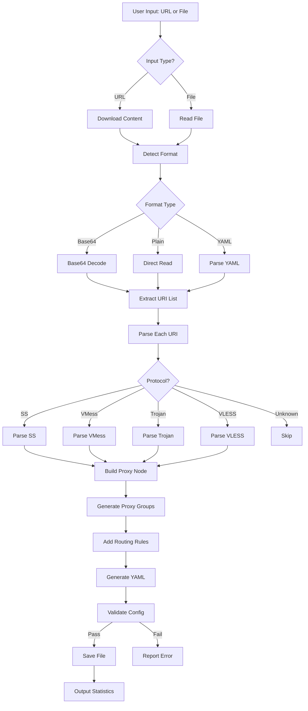

# Development Documentation

> Technical documentation for developers and contributors of the Clash Subscription Converter.

---

## 📋 Table of Contents

1. [Project Background](#project-background)
2. [Architecture Overview](#architecture-overview)
3. [Module Design](#module-design)
4. [Workflow Details](#workflow-details)
5. [API Reference](#api-reference)
6. [Testing Strategy](#testing-strategy)
7. [Configuration Templates](#configuration-templates)
8. [Troubleshooting Guide](#troubleshooting-guide)
9. [Contributing Guidelines](#contributing-guidelines)
10. [Roadmap](#roadmap)

---

## 📖 Project Background

### Problem Statement

The traditional workflow for converting Clash proxy subscriptions requires 20+ manual steps:
1. **Tedious process**: Multiple tools needed (curl, base64, text editor)
2. **Repetitive work**: Same steps required every time subscription updates
3. **Format conversion**: Base64 decoding, URI parsing, YAML generation need different tools
4. **No validation**: Manual operations make it difficult to verify intermediate results
5. **Maintenance burden**: Changing airports/subscriptions requires relearning the process

### Solution Design

This tool provides:
- **One-click conversion**: Input subscription link → Output complete configuration
- **Automatic format detection**: Recognizes base64/plain text/YAML formats
- **Multi-protocol support**: SS/VMess/Trojan/VLESS
- **Configuration templates**: Customizable proxy groups and routing rules
- **Validation**: Automatic verification of generated config against Clash specifications

---

## 🏗️ Architecture Overview

### Directory Structure

```
proxyYAML_decoder/
├── clash_sub_converter.py      # Main CLI entry point
├── README.md                   # User documentation
├── DEVELOPMENT.md              # This file - Developer documentation
├── config_template.yaml        # Default configuration template
├── requirements.txt            # Python dependencies
├── modules/
│   ├── __init__.py
│   ├── downloader.py           # HTTP download module
│   ├── decoder.py              # Format detection and decoding
│   ├── parser.py               # URI parser (SS/VMess/Trojan/VLESS)
│   ├── generator.py            # YAML configuration generator
│   └── validator.py            # Configuration validation
├── tests/
│   ├── __init__.py
│   ├── test_all.py             # Unified test suite
│   └── test_samples/           # Test sample files
├── subscribe_yaml_output/      # URL subscription outputs
└── test_yaml_output/           # Local file test outputs
```

### Dependencies

```
requests>=2.31.0        # HTTP requests
pyyaml>=6.0            # YAML processing
```

---

## 📦 Module Design

### 1. Downloader Module (`modules/downloader.py`)

Handles HTTP downloads with custom User-Agent and retry logic.

```python
class SubscriptionDownloader:
    """
    Download subscription content from URL with custom headers and timeout.
    
    Attributes:
        user_agent (str): HTTP User-Agent header
        timeout (int): Request timeout in seconds
    
    Methods:
        download(url: str) -> bytes: Download content from URL
    """
```

**Key Implementation:**
```python
def download(self, url: str) -> bytes:
    headers = {
        'User-Agent': 'Mozilla/5.0 (X11; Linux aarch64) AppleWebKit/537.36 ...'
    }
    response = requests.get(url, headers=headers, timeout=self.timeout)
    response.raise_for_status()
    return response.content
```

### 2. Decoder Module (`modules/decoder.py`)

Detects content format and performs decoding.

```python
class FormatDecoder:
    """
    Detect and decode subscription content format.
    
    Supported formats:
        - base64: Base64 encoded URI list
        - plain: Plain text URI list
        - yaml: Clash YAML configuration
    
    Methods:
        detect_format(content: bytes) -> str
        decode(content: bytes) -> str
    """
```

**Format Detection Logic:**
```python
def detect_format(self, content: bytes) -> str:
    # Check for YAML markers
    if b'proxies:' in content or b'proxy-groups:' in content:
        return 'yaml'
    
    # Check for plain URI list
    if b'ss://' in content or b'vmess://' in content:
        return 'plain'
    
    # Try base64 decode
    try:
        decoded = base64.b64decode(content)
        if b'ss://' in decoded or b'vmess://' in decoded:
            return 'base64'
    except:
        pass
    
    return 'unknown'
```

### 3. Parser Module (`modules/parser.py`)

Parses proxy URIs into structured dictionaries.

```python
class URIParser:
    """
    Parse proxy URIs into Clash-compatible proxy dictionaries.
    
    Supported protocols:
        - Shadowsocks (ss://)
        - VMess (vmess://)
        - Trojan (trojan://)
        - VLESS (vless://)
    
    Methods:
        parse(uri: str) -> dict
        parse_batch(uris: list) -> list
    """
```

**Shadowsocks URI Format:**
```
ss://[base64(method:password)]@server:port#name
ss://[base64(method:password@server:port)]#name (alternative)
```

**VMess URI Format:**
```
vmess://[base64(JSON config)]
```

**Parsing Example (SS):**
```python
def parse_ss(self, uri: str) -> dict:
    # Remove protocol prefix
    content = uri[5:]  # Remove "ss://"
    
    # Extract name
    parts = content.split('#', 1)
    name = urllib.parse.unquote(parts[1]) if len(parts) > 1 else "Unknown"
    
    # Parse authentication and server
    auth_server = parts[0]
    # ... decode and extract method, password, server, port
    
    return {
        'name': name,
        'type': 'ss',
        'server': server,
        'port': int(port),
        'cipher': method,
        'password': password,
        'udp': True
    }
```

### 4. Generator Module (`modules/generator.py`)

Generates Clash YAML configuration from parsed proxies.

```python
class ClashConfigGenerator:
    """
    Generate Clash configuration YAML from proxy list.
    
    Features:
        - Configurable ports and settings
        - Automatic proxy group generation
        - Default routing rules
    
    Methods:
        generate(proxies: list, config: dict = None) -> str
    """
```

**Generated Structure:**
```yaml
port: 7890
socks-port: 7891
allow-lan: true
mode: rule
log-level: info

proxies:
  - name: "Node1"
    type: ss
    server: server.com
    port: 8388
    ...

proxy-groups:
  - name: PROXY
    type: select
    proxies: [Auto, Node1, Node2, ...]
  - name: Auto
    type: url-test
    proxies: [Node1, Node2, ...]
    url: http://www.gstatic.com/generate_204
    interval: 300

rules:
  - GEOIP,CN,DIRECT
  - MATCH,PROXY
```

### 5. Validator Module (`modules/validator.py`)

Validates generated YAML configuration.

```python
class ConfigValidator:
    """
    Validate Clash configuration syntax and structure.
    
    Validations:
        - YAML syntax correctness
        - Required fields presence (proxies, proxy-groups, rules)
        - Proxy structure validity
    
    Methods:
        validate(yaml_content: str) -> dict
    """
```

---

## 🔄 Workflow Details

### Complete Processing Flow



### Step-by-Step Processing

#### Step 1: Download/Read Content
```python
# URL mode
downloader = SubscriptionDownloader()
content = downloader.download(url)

# File mode
with open(filepath, 'rb') as f:
    content = f.read()
```

#### Step 2: Format Detection
```python
decoder = FormatDecoder()
format_type = decoder.detect_format(content)
# Returns: 'base64', 'plain', 'yaml', or 'unknown'
```

#### Step 3: Content Decoding
```python
decoded_content = decoder.decode(content)
# Returns decoded string with URI list
```

#### Step 4: URI Parsing
```python
parser = URIParser()
uri_list = decoded_content.strip().split('\n')
proxies = []

for uri in uri_list:
    proxy = parser.parse(uri)
    if proxy:
        proxies.append(proxy)
```

#### Step 5: YAML Generation
```python
generator = ClashConfigGenerator()
yaml_content = generator.generate(proxies)
```

#### Step 6: Validation
```python
validator = ConfigValidator()
result = validator.validate(yaml_content)
# Returns: {'valid': True/False, 'errors': [...]}
```

#### Step 7: Save Output
```python
# Generate timestamped filename
from datetime import datetime
timestamp = datetime.now().strftime('%Y%m%d_%H%M%S')
filename = f'subscribe_{timestamp}.yaml'

# Save to appropriate directory
output_path = os.path.join(output_dir, filename)
with open(output_path, 'w') as f:
    f.write(yaml_content)
```

---

## 📚 API Reference

### ClashSubscriptionConverter Class

Main converter class in `clash_sub_converter.py`.

```python
class ClashSubscriptionConverter:
    """
    Main converter class that orchestrates the conversion process.
    
    Attributes:
        downloader: SubscriptionDownloader instance
        decoder: FormatDecoder instance
        parser: URIParser instance
        generator: ClashConfigGenerator instance
        validator: ConfigValidator instance
    
    Methods:
        convert_url(url: str, output_path: str = None) -> dict
        convert_file(filepath: str, output_path: str = None) -> dict
    """
```

**Usage Example:**
```python
from clash_sub_converter import ClashSubscriptionConverter

converter = ClashSubscriptionConverter()

# From URL
result = converter.convert_url("https://example.com/sub?token=xxx")
print(f"Converted {result['proxy_count']} proxies")
print(f"Output: {result['output_path']}")

# From file
result = converter.convert_file("/path/to/sub.txt")
```

**Return Value:**
```python
{
    'success': True,
    'proxy_count': 54,
    'output_path': '/path/to/output.yaml',
    'protocols': {'ss': 50, 'vmess': 4},
    'errors': []
}
```

---

## 🧪 Testing Strategy

### Test Structure

```
tests/
├── __init__.py
├── test_all.py              # Unified test suite
└── test_samples/
    ├── base64_sample.txt    # Base64 encoded sample
    ├── plain_sample.txt     # Plain URI list sample
    └── yaml_sample.yaml     # YAML format sample
```

### Running Tests

```bash
# Run all tests
cd /home/jetson/2025_FYP/proxyYAML_decoder
python3 -m pytest tests/ -v

# Run with coverage
python3 -m pytest tests/ --cov=modules --cov-report=html

# Run specific test file
python3 -m pytest tests/test_all.py -v
```

### Test Categories

#### Unit Tests
```python
# Test decoder module
def test_detect_base64_format():
    decoder = FormatDecoder()
    content = base64.b64encode(b'ss://xxx\nvmess://yyy')
    assert decoder.detect_format(content) == 'base64'

def test_decode_base64():
    decoder = FormatDecoder()
    content = base64.b64encode(b'ss://test@server:8388#node1')
    result = decoder.decode(content)
    assert 'ss://' in result
```

#### Integration Tests
```python
def test_full_conversion_url():
    converter = ClashSubscriptionConverter()
    result = converter.convert_file('tests/test_samples/base64_sample.txt')
    
    assert result['success'] == True
    assert result['proxy_count'] > 0
    assert os.path.exists(result['output_path'])
```

### Test Data Preparation

```bash
# Create test samples
mkdir -p tests/test_samples

# Sample 1: Base64 encoded URI list
echo "c3M6Ly9..." > tests/test_samples/base64_sample.txt

# Sample 2: Plain URI list
cat > tests/test_samples/plain_sample.txt << EOF
ss://YWVzLTI1Ni1nY206cGFzc3dvcmQ@server1.com:8388#Node1
vmess://eyJ2IjoiMiIsInBzIjoiTm9kZTIiLCJhZGQiOiJzZXJ2ZXIyLmNvbSJ9
EOF
```

---

## 🛠️ Configuration Templates

### Basic Template (config_template.yaml)

```yaml
# Clash basic configuration template
# Used by proxyYAML_decoder

# Basic settings
port: 7890                # HTTP proxy port
socks-port: 7891          # SOCKS5 proxy port
allow-lan: true           # Allow LAN connections
mode: rule                # Rule mode
log-level: info           # Log level
ipv6: false               # Disable IPv6

# External control
external-controller: 127.0.0.1:9090
secret: ""

# DNS settings
dns:
  enable: true
  listen: 0.0.0.0:53
  enhanced-mode: fake-ip
  nameserver:
    - 223.5.5.5
    - 119.29.29.29
  fallback:
    - 8.8.8.8
    - 1.1.1.1

# Proxy group template
proxy-groups:
  - name: PROXY
    type: select
    proxies:
      - Auto
      # [PROXIES] - Auto-replaced with node list
      
  - name: Auto
    type: url-test
    proxies:
      # [PROXIES] - Auto-replaced with node list
    url: http://www.gstatic.com/generate_204
    interval: 300

# Rule template
rules:
  # Ad blocking
  - DOMAIN-SUFFIX,ad.com,REJECT
  
  # Streaming
  - DOMAIN-SUFFIX,youtube.com,PROXY
  - DOMAIN-SUFFIX,netflix.com,PROXY
  
  # AI services
  - DOMAIN-SUFFIX,openai.com,PROXY
  - DOMAIN-SUFFIX,claude.ai,PROXY
  
  # China direct
  - GEOIP,CN,DIRECT
  
  # Default proxy
  - MATCH,PROXY
```

### Advanced Template (Region-based Groups)

```yaml
proxy-groups:
  - name: PROXY
    type: select
    proxies:
      - Auto
      - HongKong
      - Japan
      - USA
      - Manual
      
  - name: Auto
    type: url-test
    proxies:
      # [PROXIES:ALL]
    url: http://www.gstatic.com/generate_204
    interval: 300
    
  - name: HongKong
    type: url-test
    proxies:
      # [PROXIES:香港|HK|Hong Kong]
    url: http://www.gstatic.com/generate_204
    interval: 300
    
  - name: Japan
    type: url-test
    proxies:
      # [PROXIES:日本|JP|Japan]
    url: http://www.gstatic.com/generate_204
    interval: 300
    
  - name: USA
    type: url-test
    proxies:
      # [PROXIES:美国|US|USA]
    url: http://www.gstatic.com/generate_204
    interval: 300
```

---

## 🔧 Troubleshooting Guide

### Common Issues

#### 1. Download Failed: Connection Timeout
**Cause**: Network issues or subscription URL requires proxy  
**Solution**:
```bash
# Option 1: Use existing proxy
export http_proxy=http://127.0.0.1:7890
export https_proxy=http://127.0.0.1:7890
python3 clash_sub_converter.py --url "..."

# Option 2: Increase timeout (future feature)
python3 clash_sub_converter.py --url "..." --timeout 60
```

#### 2. Decode Failed: Invalid Base64
**Cause**: Content might not be base64 encoded  
**Solution**:
```bash
# Manually check raw content
curl -o raw_sub.txt "subscription_url"
head -c 200 raw_sub.txt

# If you see "proxies:" - it's standard YAML, use directly
# If you see "ss://" - it's plain URI list
```

#### 3. Parse Failed: Invalid URI Format
**Cause**: Subscription contains unsupported protocols or malformed URIs  
**Solution**:
```bash
# Enable debug mode to see details
python3 clash_sub_converter.py --url "..." --debug
```

#### 4. Clash Won't Load Configuration
**Cause**: YAML syntax errors or incompatible configuration  
**Solution**:
```bash
# Verify YAML syntax
python3 -c "import yaml; yaml.safe_load(open('config.yaml'))"

# Use online tools for validation
# https://www.yamllint.com/
```

### Debug Mode

```bash
# Enable detailed logging
python3 clash_sub_converter.py \
  --url "..." \
  --log-level DEBUG \
  --log-file converter.log

# View logs
tail -f converter.log
```

---

## 🤝 Contributing Guidelines

### Development Environment Setup

```bash
# Create virtual environment
python3 -m venv venv
source venv/bin/activate

# Install dependencies
pip install -r requirements.txt
pip install pytest black flake8  # Dev dependencies

# Run tests
python3 -m pytest tests/ -v

# Code formatting
black clash_sub_converter.py modules/

# Code linting
flake8 clash_sub_converter.py modules/
```

### Commit Convention

```bash
# Format: <type>: <subject>

# Types:
# feat: New feature
# fix: Bug fix
# docs: Documentation update
# refactor: Code refactoring
# test: Test-related
# chore: Build/toolchain updates

# Examples
git commit -m "feat: add VLESS protocol support"
git commit -m "fix: resolve base64 padding error"
git commit -m "docs: update API reference"
```

### Pull Request Process

1. Fork the repository
2. Create feature branch: `git checkout -b feat/your-feature`
3. Make changes and add tests
4. Run tests: `python3 -m pytest tests/ -v`
5. Format code: `black .`
6. Commit with proper message
7. Push and create Pull Request

---

## 🗺️ Roadmap

### Version 1.0.0 ✅ (Completed)
- ✅ Shadowsocks subscription support
- ✅ Base64 decoding
- ✅ URI parsing
- ✅ YAML generation
- ✅ Basic validation

### Version 1.1.0 ✅ (Current)
- ✅ VMess/Trojan/VLESS support
- ✅ Timestamped output files
- ✅ Organized output directories
- ✅ Enhanced console mode
- ✅ Separated documentation

### Version 1.2.0 (Planned)
- [ ] Configuration template system
- [ ] Multiple format auto-detection
- [ ] Detailed error messages
- [ ] Progress display (Rich library)
- [ ] Configuration file input (yaml/json)

### Version 2.0.0 (Future)
- [ ] Node connectivity testing
- [ ] Latency speed test
- [ ] Subscription management (CRUD)
- [ ] Configuration diff comparison
- [ ] Scheduled auto-update
- [ ] Web UI interface (optional)

---

## 📚 External Resources

### Clash Configuration
- [Clash Official Documentation](https://github.com/Dreamacro/clash/wiki/configuration)
- [Clash Premium Configuration](https://github.com/Dreamacro/clash/wiki/premium/configuration)

### Proxy Protocol Specifications
- [Shadowsocks URI Scheme](https://shadowsocks.org/en/config/quick-guide.html)
- [V2Ray Configuration Guide](https://www.v2ray.com/chapter_02/)

### Python Libraries
- [Requests Documentation](https://requests.readthedocs.io/)
- [PyYAML Documentation](https://pyyaml.org/wiki/PyYAMLDocumentation)

---

## 💡 Design Philosophy

### 1. Simplicity First
Users only need to care about "input link → get configuration". The intermediate process is fully automated.

### 2. Fault Tolerance
Even if some nodes fail to parse, a usable configuration can still be generated without affecting overall usage.

### 3. Extensibility
Modular design allows adding new protocol support by simply adding a corresponding parser without affecting existing functionality.

### 4. Configurability
Template system provides customizable options to meet different users' personalization needs.

### 5. Observability
Detailed log output and statistics let users clearly understand the processing process.

---

## 📄 License

MIT License

---

**Last Updated**: 2026-01-11 | **Version**: 1.1.0
